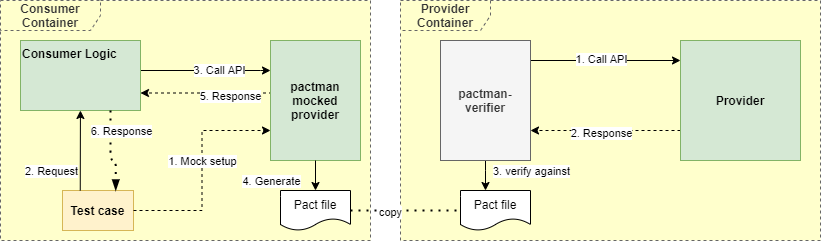

# python-pact-demo
Demo project for Pact or Contract Testing in Python

## Compile
docker-compose build

## Starting the containers
docker-compose up -d

## Creating Pact from consumer
First, go inside consumer container

'docker exec -it consumer-pact-demo sh

Go inside src directory

'#cd src

Run 'pytest', a file named Consumer-Provider-pact.json shall be generated

Now run the pact verification as per following syntax:

pactman-verifier -l "pact-file.json" "Provider-Name" "Provider-URI" "Provider-States-URI"

It will look as shown below:

'#pactman-verifier -l Consumer-Provider-pact.json Provider http://provider-pact-demo:50010 http://provider-pact-demo:50010/_pact/provider_states

#### Ideally, you shall copy the pact json file to provider's location and run verification from there itself.

